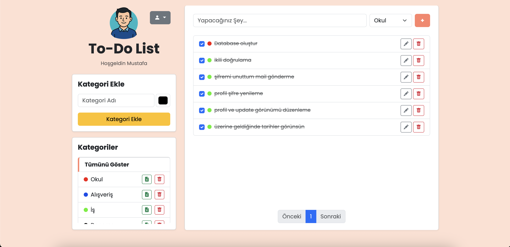

# 📝 To-Do List Web Application

A full-featured to-do list web application built using **PHP, MySQL, HTML, CSS, Bootstrap, and JavaScript**. The project includes user authentication, 2FA verification, task management, category organization, and export functionalities.

## Features

- 🔐 User registration and login
- 🔁 Forgot password functionality (email-based token system)
- ✅ Two-Factor Authentication (2FA) via email
- 🧑‍💼 Profile editing
- 🗑️ Delete account
- ➕ Add to-do items
- ✏️ Edit existing to-do items
- 📁 Add and manage categories
- 📦 Export categories with their to-dos as an Excel file

## 📸 Screenshots

| Login Page | 2FA Page | To-Do Dashboard |
|------------|----------|------------------|
|  |  |  |

## 🛠️ Technologies

- **Frontend**: HTML, CSS, Bootstrap, JavaScript
- **Backend**: PHP
- **Database**: MySQL
- **Mail Service**: PHPMailer with Mailtrap (SMTP)

